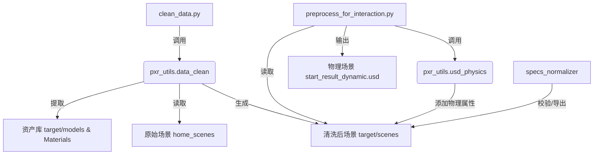

# 项目深度分析报告

我已完成对 `usd-scene-physics-prep` 项目的全面调研，以下是按照您的要求进行的详细分析。

## 1. 项目结构分析

### 目录结构概览
项目是一个典型的 Python 工具集，核心逻辑位于 `set_physics` 目录，文档非常完善。

*   **根目录**: 包含入口脚本 `clean_data.py` 和项目说明 `README.md`。
*   **`docs/`**: 包含详尽的架构文档、模块说明和使用指南（如 `architecture/pipeline.md`, `usage/quickstart.md`）。
*   **`set_physics/`**: 核心业务逻辑代码。
    *   `pxr_utils/`: USD 处理底层工具，核心是 `data_clean.py`（场景拆分）和 `usd_physics.py`（物理属性设置）。
    *   `scripts/`: 预处理脚本和辅助工具。
    *   `preprocess_for_interaction.py`: 交互场景的物理预处理入口。
    *   `preprocess_for_navigation.py`: 导航场景的物理预处理入口。
*   **`specs_normalizer/`**: 负责将 `target/` 下的输出导出为标准化的数据集结构，并提供检查工具 `check.py`。
*   **`check_reports/`**: 存放 `check.py` 生成的 JSON 报告。

### 配置文件与环境
*   **配置**: 主要通过代码中的常量定义（如 `PICKABLE_OBJECTS` 列表），部分脚本支持命令行参数（如 `specs_normalizer/check.py` 使用 `argparse`）。
*   **环境**: 依赖 `isaacsim` 环境（提供 `omni` 模块）和 `usd-core`（`pxr` 库）。

## 2. 代码审查与核心逻辑

### 核心模块
1.  **数据清洗 (`set_physics/pxr_utils/data_clean.py`)**:
    *   **功能**: `parse_scene` 函数负责读取原始 USD，将资产拆分为独立的 `models` 和 `Materials`，并重建引用关系。
    *   **关键算法**: `transform_to_rt` 将 `xformOp:transform` 矩阵分解为 `translate/orient/scale`，这是物理仿真稳定性的关键。
    *   **资产指纹**: 通过哈希算法处理模型，避免重复存储。

2.  **物理预处理 (`set_physics/preprocess_for_interaction.py` & `usd_physics.py`)**:
    *   **功能**: 为场景对象添加刚体（RigidBody）和碰撞体（Collider）。
    *   **逻辑**: 遍历场景树，根据对象名称或类别（如在 `PICKABLE_OBJECTS` 中）决定应用哪种碰撞近似（Convex Decomposition, Convex Hull, SDF 等）。
    *   **关键函数**: `bind_rigid_for_merged_mesh`, `set_collider_with_approx`, `bind_articulation` (处理关节对象)。

3.  **规范化导出 (`specs_normalizer`)**:
    *   **功能**: 验证目录结构完整性 (`check.py`) 并执行最终的格式标准化。

### 关键数据流
*   **输入**: 原始 USD 场景 (`home_scenes/<id>/start_result_fix.usd`).
*   **中间态**: 清洗后的 `target/` 目录，包含解耦的模型、材质和场景文件。
*   **输出**: 带有物理属性的 USD 文件 (`start_result_dynamic.usd`) 和最终规范化数据集。

## 3. 依赖关系梳理

### 第三方库
*   **`usd-core` (pxr)**: 核心依赖，用于所有 USD 文件操作。
*   **`isaacsim`**: 仿真环境，提供 `SimulationApp` 和物理 schema (`PhysxSchema`)。
*   **`numpy`**: 矩阵运算（在 `transform_to_rt` 中使用）。
*   **`pandas`**: 读取 CSV 数据（部分辅助脚本）。

### 模块交互流程

## 4. 运行机制

*   **启动**: 通过 `clean_data.py` 启动清洗流程，或直接运行 `set_physics/preprocess_*.py` 进行物理处理。
*   **物理绑定策略**:
    *   **可交互物体**: 使用 `Convex Decomposition` 近似，启用刚体。
    *   **静态环境**: 使用 `Triangle Mesh` 或 `Mesh Simplification`，仅启用碰撞，无刚体。
    *   **关节物体**: 递归识别 `UsdPhysics.Joint` 并启用。

## 5. 总结与下一步
本项目是一个成熟的 USD 资产处理流水线，代码结构清晰，文档完备。核心难点在于对 USD 复杂变换的标准化处理以及针对不同仿真需求（交互 vs 导航）的物理属性自动绑定。

**下一步计划**:
目前已完成对项目的全面认知。请指示具体开发任务（如功能开发、Bug 修复或性能优化），我将根据此认知直接开展工作。