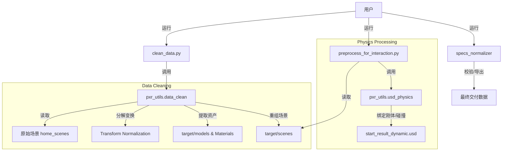

# 项目深度分析报告

> 生成日期: 2025-12-28
> 基于当前代码库状态的系统性分析。

## 1. 项目结构分析

### 目录结构概览
本项目是一个用于 USD 场景资产拆分与物理仿真预处理的工具集，核心逻辑位于 `set_physics` 目录。

*   **根目录**:
    *   `clean_data.py`: 数据清洗流程入口脚本。
    *   `README.md`: 项目基础说明。
*   **`docs/`**: 包含详尽的架构文档、模块说明和使用指南。
    *   `architecture/`: 包含 `pipeline.md` (流水线) 和 `directory_structure.md`。
    *   `modules/`: 各个子模块的详细说明。
    *   `usage/`: 用户操作指南。
*   **`set_physics/`**: 核心业务逻辑代码。
    *   `pxr_utils/`: USD 处理底层工具库。
        *   `data_clean.py`: 负责场景解析、资产拆分、变换规范化。
        *   `usd_physics.py`: 负责物理属性（刚体、碰撞体、关节）的绑定与设置。
    *   `scripts/`: 各类辅助脚本与预处理脚本。
    *   `preprocess_for_interaction.py`: 交互场景的物理预处理逻辑。
    *   `preprocess_for_navigation.py`: 导航场景的物理预处理逻辑。
*   **`specs_normalizer/`**: 数据集规范化导出模块。
    *   `check.py`: 结构检查工具。
    *   `exporters/`: 负责将处理后的资产导出为最终交付格式。

### 配置文件与环境
*   **配置方式**: 主要通过代码中的常量定义（如 `set_physics/preprocess_for_interaction.py` 中的 `PICKABLE_OBJECTS` 列表）。
*   **运行环境**:
    *   **Omniverse Isaac Sim**: 提供 `omni` 模块和物理仿真支持。
    *   **Python 依赖**: `usd-core` (pxr), `numpy`, `pandas`.

## 2. 代码审查与核心逻辑

### 核心模块详解

#### 1. 数据清洗 (`set_physics/pxr_utils/data_clean.py`)
*   **`parse_scene`**: 主函数，递归遍历原始 USD 场景。
*   **`transform_to_rt`**: 关键算法。将通用的 `xformOp:transform` 矩阵分解为 `translate`, `orient`, `scale`。这是为了确保物理引擎（PhysX）能正确处理物体的变换，因为物理引擎通常偏好 TRS 分解形式而非矩阵。
*   **资产重组**: 将场景中的模型提取为独立的 USD 文件，存放在 `target/models`，并利用哈希值进行去重。

#### 2. 物理预处理 (`set_physics/preprocess_for_interaction.py` & `usd_physics.py`)
*   **物理绑定策略**:
    *   **可交互物体 (Pickable)**: 识别列表中的物体（如 `bottle`, `can` 等），为其添加 `RigidBodyAPI` 和 `CollisionAPI`。使用 `Convex Decomposition` (凸分解) 作为碰撞近似，以平衡性能和形状准确度。
    *   **静态环境 (Static)**: 对墙壁、地板等物体，仅添加 `CollisionAPI`，不添加刚体。使用 `Triangle Mesh` 或 `Mesh Simplification` 作为碰撞近似。
    *   **关节物体 (Articulated)**: 递归查找 `UsdPhysics.Joint`，确保关节被正确启用，并为其连接的 Body 添加刚体属性。
*   **`usd_physics.py`**: 封装了 `set_rigidbody`, `set_collider_with_approx` 等原子操作，屏蔽了底层的 USD API 细节。

#### 3. 规范化导出 (`specs_normalizer`)
*   用于在物理处理完成后，对目录结构进行最终的校验和整理，确保输出符合交付标准（Materials, Assets, Scenes 三大目录结构）。

## 3. 依赖关系与交互流程

### 模块交互流程图

## 4. 运行机制

1.  **初始化**: `clean_data.py` 扫描输入目录，调用 `data_clean.py` 进行多线程或循环处理。
2.  **数据流**: 
    *   Raw USD -> (Clean & Split) -> Normalized Components (Models/Materials/Scene) -> (Physics Binding) -> Simulation Ready USD.
3.  **关键控制流**:
    *   通过文件名哈希判断资产是否已存在，实现增量处理。
    *   通过 `PICKABLE_OBJECTS` 白名单控制哪些物体变成动态刚体。

## 5. 总结
本项目构建了一套完整的 USD 场景处理流水线，成功解决了从原始美术资产到仿真可用资产的转化问题。代码结构模块化程度高，文档支持完善。核心技术点在于对 USD 变换的标准化处理和基于语义（名称/类别）的物理属性自动绑定。
